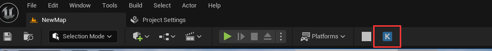
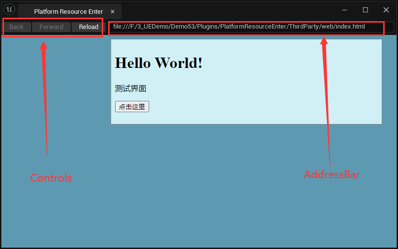

# 平台资源插件

## WebBrowser

使用 `WebBrowser` 来进行资源列表的显示和操作

使用 `WebBrowser` 的优势是不可以用浏览器的内核来显示资源的预览图、预览视频等；再一个就是该插件大部分都是参考 `Quixel Bridge` 插件，所以直接参考他们的代码就行

`Unreal Engine` 的 `WebBrowser` 模块允许你在游戏或应用程序中嵌入一个网页浏览器。这个模块非常适合需要显示网页内容或与网页进行交互的场景。

`WebBrowser` 模块基于 `Chromium Embedded Framework` (`CEF`)，这是一个开源的 `Web` 浏览器框架，允许开发者将 `Chromium` 浏览器嵌入到其他应用程序中。`CEF` 提供了完整的浏览器功能，包括 `HTML` `渲染、JavaScript` 解释和执行、网络请求处理等

### 注册按钮

注册入口按钮，当点击按钮之后创建一个 `WebBrowser` 窗口

```cpp
// 注册入口按钮
UToolMenu* UserMenu = UToolMenus::Get()->ExtendMenu("LevelEditor.LevelEditorToolBar.PlayToolBar");
FToolMenuSection& Section = UserMenu->FindOrAddSection("PluginTools");
Section.AddEntry(FToolMenuEntry::InitToolBarButton("PRE Button",
    FUIAction(FExecuteAction::CreateRaw(this, &FPREUIManagerImpl::CreateWindow)),
    TAttribute<FText>(),
    TAttribute<FText>(),
    FSlateIcon(FPREStyle::GetStyleSetName(), "PRE.MenuLogo")
));

// 根据名称注册 Tab 窗口的创建
FGlobalTabmanager::Get()->RegisterNomadTabSpawner(PRETabName,
    FOnSpawnTab::CreateRaw(this, &FPREUIManagerImpl::CreateWindowTab))
    .SetDisplayName(PRETabDisplay).SetAutoGenerateMenuEntry(false).SetTooltipText(PREToolTip);
```



至于如何 `Logo` 如何设置，直接参考 `BridgeStyle` 的写法就行

```cpp
void FPREStyle::SetSVGIcon(const FString& StyleName, const FString& ResourcePath)
{
	FSlateStyleSet* Style = MSStyleInstance.Get();

	FString Name(GetContextName().ToString());
	Name = Name + "." + StyleName;
	Style->Set(*Name, new FSlateVectorImageBrush(Style->RootToContentDir(ResourcePath, TEXT(".svg")), Icon40x40));

	Name += ".Small";
	Style->Set(*Name, new FSlateVectorImageBrush(Style->RootToContentDir(ResourcePath, TEXT(".svg")), Icon20x20));

	FSlateApplication::Get().GetRenderer()->ReloadTextureResources();
}

TUniquePtr<FSlateStyleSet> FPREStyle::Create()
{
	TUniquePtr< FSlateStyleSet > Style = MakeUnique<FSlateStyleSet>(GetStyleSetName());
	Style->SetContentRoot(FPaths::ProjectPluginsDir() / TEXT("PlatformResourceEnter/Resources"));
	return Style;
}
```

这里通过在 `FPREStyle::Create` 中设置了 `ContentRoot` 为 `FPaths::ProjectPluginsDir() / TEXT("PlatformResourceEnter/Resources")` 也就是插件路径中的 `Resource` 文件夹

随后在 `FPREStyle::SetSVGIcon` 中使用 `Style->RootToContentDir(ResourcePath, TEXT(".svg")` 就可以得到 `C:\Proj\Demo53\Plugins\PRE\Resources\PREB.svg` 文件了

### 创建窗口

使用 `FPREUIManagerImpl::CreateWindow` 创建窗口，但是看看里面的代码

```cpp
FGlobalTabmanager::Get()->TryInvokeTab(PRETabName);
```

第一行就是尝试打开一个名为 `PRETabName` 的 `Tab`，如果该 `Tab` 已经打开就让其激活

而这个 `PORETabName` 就是之前在 `FGlobalTabmanager::Get()->RegisterNomadTabSpawner` 中注册的，注册了名字和对应的创建函数，所以窗口真正的创建函数在 `FPREUIManagerImpl::CreateWindowTab` 中

这里会出现三个对象，分别是 `Browser`、`WebBrowserWidget`、`LocalBrowserDock`

```cpp
TSharedPtr<IWebBrowserWindow> Browser;
TSharedPtr<SWebBrowser> WebBrowserWidget;
TSharedPtr<SDockTab> LocalBrowserDock;
```

| 名称 | 类型 | 作用 |
| --- | --- | --- |
| Browser | IWebBrowserWindow | 负责管理浏览器窗口的生命周期和操作，例如加载 URL、执行 JavaScript、处理浏览器事件等。Browser 是 WebBrowserWidget 的底层实现，提供实际的浏览器功能 |
| WebBrowserWidget | SWebBrowser | 提供了在 Unreal Engine 中嵌入浏览器的功能，允许在游戏或应用程序中显示网页内容 |
| LocalBrowserDock | SDockTab | 用于在 Unreal Engine 编辑器中创建一个新的标签页，并将 WebBrowserWidget 嵌入其中 |

> 上面三种对象就是一一嵌套的关系

那么按照顺序，首先创建 `Browser`，创建浏览器窗口对象需要对应的链接地址

```cpp
FString PluginPath = FPaths::Combine(FPaths::ProjectPluginsDir(), TEXT("PlatformResourceEnter"));
FString IndexUrl = FPaths::ConvertRelativePathToFull(FPaths::Combine(PluginPath, TEXT("ThirdParty"), TEXT("web"), TEXT("index.html")));

FString FinalUrl = FPaths::Combine(TEXT("file:///"), IndexUrl);
```

通过上述代码，获得 `ThirdParty\Web\index.html` 路径，也就是入口网页

```cpp
	TSharedPtr<SWebBrowser> PluginWebBrowser;

#elif PLATFORM_WINDOWS || PLATFORM_LINUX
	FWebBrowserInitSettings browserInitSettings = FWebBrowserInitSettings();
	IWebBrowserModule::Get().CustomInitialize(browserInitSettings);
	WindowSettings.InitialURL = FinalUrl;
	WindowSettings.BrowserFrameRate = 60;
	if (IWebBrowserModule::IsAvailable() && IWebBrowserModule::Get().IsWebModuleAvailable())
	{
		IWebBrowserSingleton* WebBrowserSingleton = IWebBrowserModule::Get().GetSingleton();
		Browser = WebBrowserSingleton->CreateBrowserWindow(WindowSettings);
		PluginWebBrowser = SAssignNew(WebBrowserWidget, SWebBrowser, Browser)
			.ShowAddressBar(false)
			.ShowControls(false);
	}
```



> 一般来说，为了美观会关闭 `AddressBar` 和 `Controls`

不过这里要额外做一些操作来吃掉点击事件，防止点击穿透影响到编辑器

```cpp
Browser->OnUnhandledKeyUp().BindLambda([](const FKeyEvent&) { return true; });
Browser->OnUnhandledKeyDown().BindLambda([](const FKeyEvent&) { return true; });
```

剩下的就是创建一个 `SDockTab` 窗口主题来包含 `SWebBrowser` 了

```cpp
// 创建并返回一个新的 SDockTab
SAssignNew(LocalBrowserDock, SDockTab)
    .OnTabClosed_Lambda([](TSharedRef<class SDockTab> InParentTab)
        {
            // 绑定结束事件
            FPREUIManager::PREBrowserBinding->OnPREExitDelegate.ExecuteIfBound("Plugin Window Closed");
            FPREUIManager::PREBrowserBinding = nullptr;

            // 清理缓存
            FPREUIManager::Instance->LocalBrowserDock = nullptr;
            if (FPREUIManager::Instance->WebBrowserWidget.IsValid())
            {
                FPREUIManager::Instance->WebBrowserWidget.Reset();
                FPREUIManager::Instance->Browser.Reset();
            }
        })
    .TabRole(ETabRole::NomadTab)
        [
            PluginWebBrowser.ToSharedRef()
        ];
```

### 事件交互

一般事务分两种

1. 浏览器中触发了某个事件要调用 UE 这层的逻辑
   - 比如下载按钮被点击了，要下载对应的内容到浏览器中
2. UE 中触发了某个事件要调用浏览器这层的逻辑
   - 比如资产发生了变化，需要刷新浏览器内容更新显示效果

其实 `WebBrowser` 的事件传递总归还是通过**事件**和**反射**来进行的

首先需要一个 `Binding` 对象

```cpp
UCLASS()
class UPREBrowserBinding : public UObject
{
	GENERATED_UCLASS_BODY()
	
public:
	FOnPREExit OnPREExitDelegate;

public:
	UFUNCTION()
	void OnExitCallback(FWebJSFunction ObExitJSCallback) {
	    OnPREExitDelegate.BindLambda(ObExitJSCallback);
    }

	UFUNCTION()
	void OnDownLoadButtonClick(FString Param1, int Param2)
    {
        UE_LOG(LogTemp, Log, TEXT("11111111111111 %d %s"), Param2, *Param1);
    }
};
```

然后将对象注册给 `SWebBrowser` 中

```cpp
if (WebBrowserWidget.IsValid())
{
    // 绑定对象 用于接收 JS 事件
    FPREUIManager::PREBrowserBinding = NewObject<UPREBrowserBinding>();
    FPREUIManager::Instance->WebBrowserWidget->BindUObject(TEXT("BrowserBinding"), FPREUIManager::PREBrowserBinding, true);
}
```

将 `JS` 对象与 `UObject` 对象进行绑定，在 `JS` 中可以通过 `BrowserBinding` 获取对象，进而调用 `UPREBrowserBinding` 对象

```javascript
<body>
  <div class="center_div">
    <h1>Hello World!</h1>
    <p>测试界面</p>
    <button onclick="test()">点击这里</button>
    <p id="demo"></p>
  </div>

  <script type="text/javascript">
    function test() {
      ue.browserbinding.ondownloadbuttonclick("js", 10086);
    }

    ue.browserbinding.onexitcallback.call(ue.browserbinding, (function(){
      alert("on exit callback");
    }))
    </script>
</body>
```

> 注意，所有的对象、函数、属性都是**小写**，只要有一个大小写不对，就是 `undefined`

思路就是 `UE` 将一个 `ue` 存储到浏览器对象中，`ue` 对象可以通过我们注册的名字来获取对应的对象

`ue.broserbinding` 就是通过 `FPREUIManager::Instance->WebBrowserWidget->BindUObject(TEXT("BrowserBinding"), FPREUIManager::PREBrowserBinding, true)` 注册的 `FPREUIManager::PREBrowserBinding` 对象

- 通过 `ue.browserbinding.ondownloadbuttonclick("js", 10086)` 实现了函数调用，将事件从 `JS` 传递给 `UE`
- 通过 `ue.browserbinding.onexitcallback.call` 来绑定 `onexitcallback` 事件，当 UE 中该事件触发时会执行 `JS` 中绑定的回调函数

